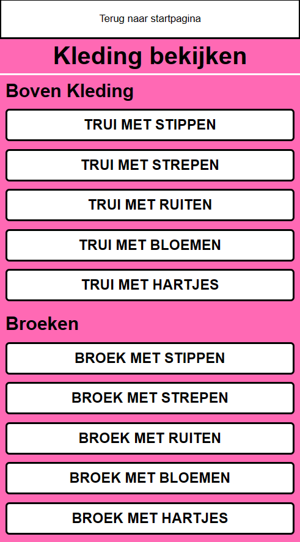
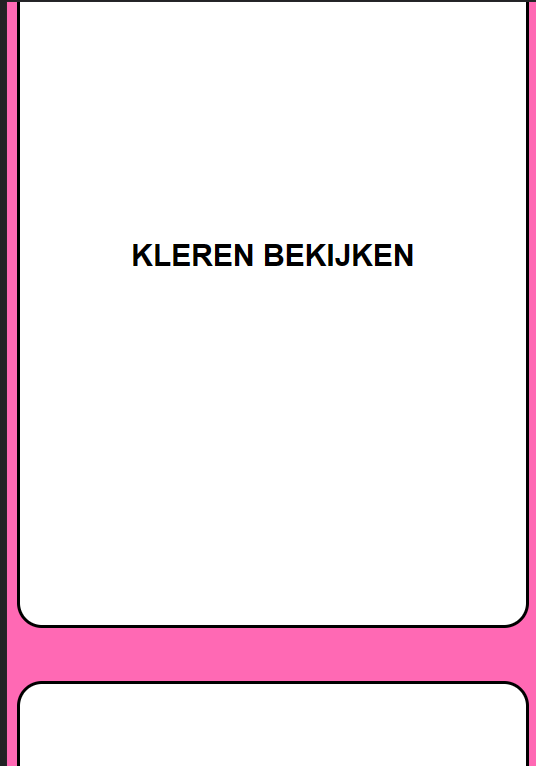
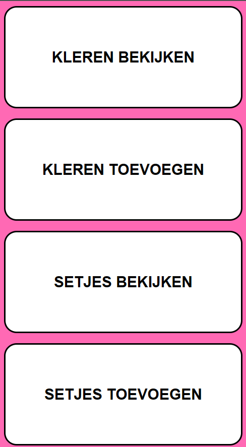
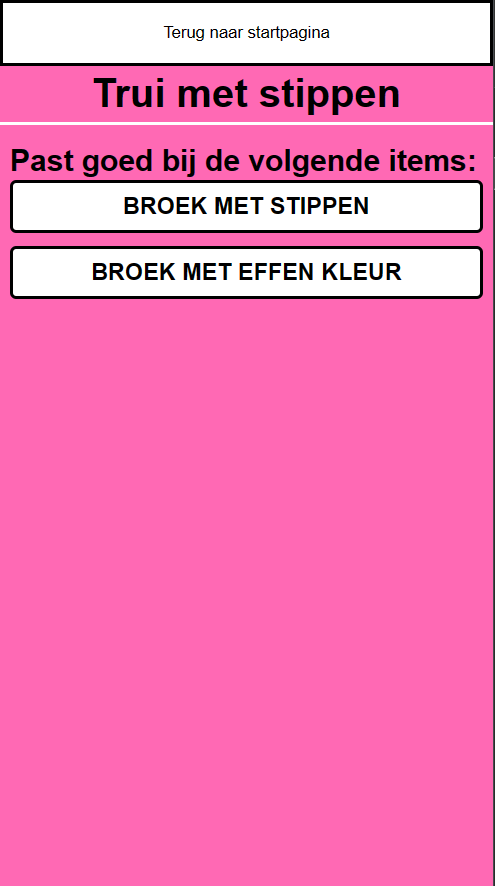

# Human Centered Design: Clothing Organizer

## Research Question
> How do you find the right color combinations for your clothes if you can't see?

## Problem Statement
For this course we have to design a product for a specific person, specifically a person with a "disability". We have to interview this person and find out what their needs are and what they would like to see in a product.

The person we have to design for is a blind person called Petra. She wants to be able to pick the right clothes for the right occasions. So she needs a system that she can use to organize her clothes and also a system that can tell her what clothes and colors she is holding.

## Solution
My solution for Petra is an app that can help her browse her clothes and also tell what other clothing options fit well with the selected item. Also the app is compatible with a screen reader so she can use it with ease. The layout is mostly based of a vertical list of items, so she doesnt have to swipe left and right to find the right item. This makes it easier to navigate the app much quicker.

## Link
[Link to the prototype](https://wyroneblue.github.io/human-centered-design-2223/)

## Reasearch and Documentation

### Test 1
Day 1 of the course we had to interview our person. We had to ask them questions about their daily life and what they would like to see in a product. We also had to ask them about their disability and how it affects their daily life.

#### Questions
These are the question asked during the interview including the answers.
| Question | Answer |
| -------- | ------ |
| Bent u blind geboren of blind geworden | Blind geboren |
| Hoe ziet uw dagelijks leven eruit? | Gewoon naar werk met ov, soms thuis, soms op kantoor. Bij cliëntenbelang Amsterdam. |
| Hoe kiest u nu uw kleding? | Sommige stukken zijn makkelijk te identificeren op bijvoorbeeld gevoel, maar bijvoorbeeld hemden of panties zijn lastiger uit elkaar te halen.|
| Waaraan identificeert u uw kledingstukken? | Stof en vorm |
| Krijgt u veel hulp thuis ? If i may ask | Nee, is meestal niet nodig, behalve bij twijfel. |
| Wat zijn uw irritaties aan applicaties/website met uw screen reader? | Hangt heel erg van de site af, soms is het helemaal niet toegankelijk. Soms komen er popups in de weg, knoppen hebben geen tekst / label. |
| Vindt u het gebruik van een mobiel fijn?(En welke telefoon heeft u?) Zo nee wat gebruikt u dan als alternatief? | Ja |
| Heeft u op het web een ervaring gehad wat u echt fijn vond en uw beperking helemaal ondersteunde? | Zoeken in google, gebruikt vaker / liever apps dan websites. Websites doen vaak veel verschillende dingen dus minder overzicht. Apps doen meestal 1 ding goed. Goede website: lovely.com |
| Maakt u gebruik van siri en wat vind u ervan | Niet zo vaak, is heel traag of suf, heeft thuis wel een google nest. Gebruikt ze vooral voor de thermostaat, die digitaal is |
| Heeft u zelf misschien ideeën of voorkeur naar een oplossing? | Nee |

#### Prototype

After the interview we were able to test our prototypes with the person. I initally had a small prototpe for the navigation system of the app,

My first prototype was a voice controlled app that would help Petra navigate the app. The app would have a list of items and she could say the name of the item to select it. This would make it easier for her to navigate the app. But after the interview I found out that Petra doesn't really like voice control anduses her phone like a normal person, so she swipes through the app and uses the screen reader to read the text on the screen. So I decided to make a prototype that is more suited for Petra.

### Test 2
Afte learning more about Petra in the first interview I decided to make a new prototype which focuses more on the scroll and screen reader functionality of the app.

#### Prototype

The prototype for test 2 has the items the height of the screen so Petra doesn't have to scroll left and right to find the right item. When an item is in the center of the screen the screen reader will read the name of the item. This makes it easier for Petra to find the right item.

When an item is double tapped you will navigate to that section of the app. For example when you double tap the "Kleren bekijken" item you will navigate clothing section of the app.

During the test I found out that when Petra swiped she would sometimes swipe 2 items at once. This is because you cant really prevent a hard swipe. This was very annoying and confusing for petra because she then couldnt find all the items.

Also when testing on a mobile phone with a screen reader I found out that the application was not really fit for it and my scroll functionality was useless, because the screen reader would interupt my speech utterances from the app.

#### Feedback
From this test and also the test from other people in my group i gathered some feedback and the potential solutions to the problems.
| Feedback | Solution |
| -------- | -------- |
| She sometimes swipes 2 items at once | Remove the full height options and replace them by flexed buttons|
| The screen reader interupts the speech utterances from the app | Remove the speech utterance and use the native screen reader from the phone and make sure the aria-labels are correct. |
| It is hard to go back to the main menu | Add a back button to the top of the screen, which is like a good standard -Petra |

### Final Prototype

#### Prototype
| Main Menu | Clothing | Picked clothing |
| --------- | -------- | ---------------- |
|  |  |  |

In the final prototype I removed the full height buttons and replaced them with flexed buttons. She can easily move through them by moving her finger up and down.

The same goes for the clothing section. The clothing section is a list of items that she can scroll through. When she double taps an item she will navigate to the details page of that item. That page will tell her what color the item is and what other clothing items fit well with the selected item.

## Design Principles

I used the following design principles to make my decisions during the design process.

### Study Situation
Before making a prototype you have to study the situation of the person you are designing for. During the interview and tests i paid attention to how Petra uses her phone and how she navigates through the app.

By studying the situation of Petra I found out that she uses her phone like a normal person and can listen very well. She swipes through the app and uses the screen reader to read the text on the screen and even send a message.

I used these findings to make the prototype more suited for Petra.

### Prioritize Identity
When designing for a specific person you have to prioritize their identity. You have to make sure that the product you are designing fits the person you are designing for.

That is why my number one priority was to make sure that the app can be used with ease. Petra is blind so she uses a screen reader to read the text on the screen. So I made sure that the app is compatible with a screen reader and that the text is easy to read.

I also made sure that the app still looks a bit nice for people close to Petra who can see, so they can also use the app to help Petra if needed.

### Ignore Conventions
It is common to use conventions in your design, because people are used to certain standards. But these standards can be ignored when you are designing for a specific person. Especially when the person has a disability.

When i looked at the way Petra uses her phone she likes to scroll through here phone and listen to the screen reader. So i decided to make the app a one column list of items and options on all pages and keep the layout simple, so she can quickly "scroll" through the available options and items.

Normally we would put items in a grid layout, but that would make it harder for Petra to navigate the app. because she would have to swipe in multiple directions to find the right item.

### Add nonsense
Petra has a funny and bright personality. I found out that she likes to make jokes. which was also prominent in the interview. So I decided to add some jokes to the app when the app is openen, but hasnt made a choice yet.

I also want to implement this same feature when she makes a choice. So when she makes a choice the app will say something like "Good choice!" or "Nice outfit!".I think that will be nice as she  also wanted to share the outfits with here friends to get their opinion.
